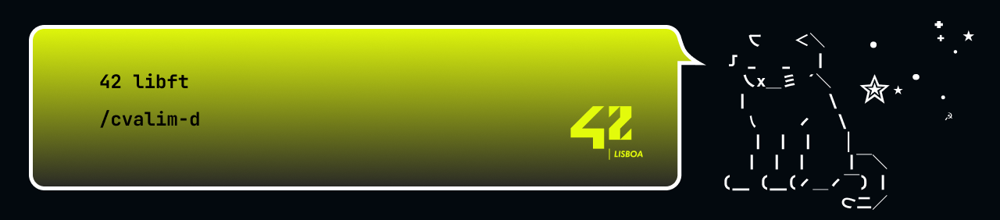

# 42Libft

## Project Description

The libft project is a foundational project at 42 School where students create their own C library, implementing commonly used standard C functions from scratch.

## Functions

### Memory Management Functions
***

#### `int ft_atoi(char *str);`
|           Description           |             Param. #1              |     Return Value      |
| :-----------------------------: | :--------------------------------: | :-------------------: |
| Converts a string to an integer | `str` - The string to be converted | The converted integer |

#### `void ft_bzero(void *s, size_t n);`
|               Description               |            Param. #1             |              Param. #2               | Return Value |
| :-------------------------------------: | :------------------------------: | :----------------------------------: | :----------: |
| Sets all bytes of a memory area to zero | `s` - Pointer to the memory area | `n` - Number of bytes to set to zero |     None     |

#### `void *ft_calloc(size_t nmemb, size_t size);`
|                       Description                        |          Param. #1           |           Param. #2           |          Return Value           |
| :------------------------------------------------------: | :--------------------------: | :---------------------------: | :-----------------------------: |
| Allocates memory for an array and initializes it to zero | `nmemb` - Number of elements | `size` - Size of each element | Pointer to the allocated memory |

#### `void *ft_memchr(const void *s, int c, size_t n);`
|         Description          |            Param. #1             |           Param. #2           |           Param. #3           |                   Return Value                    |
| :--------------------------: | :------------------------------: | :---------------------------: | :---------------------------: | :-----------------------------------------------: |
| Scans memory for a character | `s` - Pointer to the memory area | `c` - Character to search for | `n` - Number of bytes to scan | Pointer to the matching byte or NULL if not found |

#### `int ft_memcmp(const void *s1, const void *s2, size_t n);`
|        Description        |                Param. #1                |                Param. #2                 |            Param. #3             |                                  Return Value                                   |
| :-----------------------: | :-------------------------------------: | :--------------------------------------: | :------------------------------: | :-----------------------------------------------------------------------------: |
| Compares two memory areas | `s1` - Pointer to the first memory area | `s2` - Pointer to the second memory area | `n` - Number of bytes to compare | < 0 if s1 is less than s2, > 0 if s1 is greater than s2, 0 if s1 is equal to s2 |

#### `void *ft_memcpy(void *dest, const void *src, size_t n);`
|    Description     |                    Param. #1                    |                 Param. #2                 |           Param. #3           |              Return Value              |
| :----------------: | :---------------------------------------------: | :---------------------------------------: | :---------------------------: | :------------------------------------: |
| Copies memory area | `dest` - Pointer to the destination memory area | `src` - Pointer to the source memory area | `n` - Number of bytes to copy | Pointer to the destination memory area |

#### `void *ft_memmove(void *dest, const void *src, size_t n);`
|             Description              |                    Param. #1                    |                 Param. #2                 |           Param. #3           |              Return Value              |
| :----------------------------------: | :---------------------------------------------: | :---------------------------------------: | :---------------------------: | :------------------------------------: |
| Copies memory area, handling overlap | `dest` - Pointer to the destination memory area | `src` - Pointer to the source memory area | `n` - Number of bytes to copy | Pointer to the destination memory area |

#### `void *ft_memset(void *s, int c, size_t len);`
|            Description            |            Param. #1             |        Param. #2        |           Param. #3            |        Return Value        |
| :-------------------------------: | :------------------------------: | :---------------------: | :----------------------------: | :------------------------: |
| Fills memory with a constant byte | `s` - Pointer to the memory area | `c` - Byte value to set | `len` - Number of bytes to set | Pointer to the memory area |

### String Manipulation Functions
***

#### `char *ft_strdup(char *src);`
|     Description     |              Param. #1              |           Return Value           |
| :-----------------: | :---------------------------------: | :------------------------------: |
| Duplicates a string | `src` - The string to be duplicated | Pointer to the duplicated string |

#### `char *ft_strchr(const char *s, int c);`
|                       Description                       |           Param. #1           |           Param. #2           |                             Return Value                              |
| :-----------------------------------------------------: | :---------------------------: | :---------------------------: | :-------------------------------------------------------------------: |
| Locates the first occurrence of a character in a string | `s` - The string to search in | `c` - The character to locate | Pointer to the first occurrence of the character or NULL if not found |

#### `char *ft_strjoin(char const *s1, char const *s2);`
|                Description                 |        Param. #1        |        Param. #2         |       Return Value        |
| :----------------------------------------: | :---------------------: | :----------------------: | :-----------------------: |
| Concatenates two strings into a new string | `s1` - The first string | `s2` - The second string | Pointer to the new string |

#### `unsigned int ft_strlcat(char *dest, const char *src, size_t size);`
|                        Description                        |            Param. #1            |         Param. #2         |                     Param. #3                     |                  Return Value                   |
| :-------------------------------------------------------: | :-----------------------------: | :-----------------------: | :-----------------------------------------------: | :---------------------------------------------: |
| Concatenates a string with another, with size limitations | `dest` - The destination string | `src` - The source string | `size` - The total size of the destination buffer | Total length of the string they tried to create |

#### `unsigned int ft_strlcpy(char *dest, char *src, unsigned int size);`
|                    Description                    |            Param. #1            |         Param. #2         |                     Param. #3                     |                  Return Value                   |
| :-----------------------------------------------: | :-----------------------------: | :-----------------------: | :-----------------------------------------------: | :---------------------------------------------: |
| Copies a string to another, with size limitations | `dest` - The destination string | `src` - The source string | `size` - The total size of the destination buffer | Total length of the string they tried to create |

#### `int ft_strlen(const char *s);`
|          Description           |          Param. #1          |     Return Value     |
| :----------------------------: | :-------------------------: | :------------------: |
| Returns the length of a string | `s` - The string to measure | Length of the string |

#### `char *ft_strmapi(char const *s, char (*f)(unsigned int, char));`
|                               Description                               |          Param. #1          |                   Param. #2                   |       Return Value        |
| :---------------------------------------------------------------------: | :-------------------------: | :-------------------------------------------: | :-----------------------: |
| Applies a function to each character of a string to create a new string | `s` - The string to iterate | `f` - The function to apply to each character | Pointer to the new string |

#### `char *ft_strnstr(const char *big, const char *little, size_t len);`
|                       Description                        |            Param. #1            |               Param. #2                |                     Param. #3                      |                             Return Value                              |
| :------------------------------------------------------: | :-----------------------------: | :------------------------------------: | :------------------------------------------------: | :-------------------------------------------------------------------: |
| Locates a substring in a string, within a certain length | `big` - The string to search in | `little` - The substring to search for | `len` - The maximum number of characters to search | Pointer to the first occurrence of the substring or NULL if not found |

#### `int ft_strncmp(char *s1, char *s2, size_t n);`
|                 Description                 |        Param. #1        |        Param. #2         |                     Param. #3                     |                                  Return Value                                   |
| :-----------------------------------------: | :---------------------: | :----------------------: | :-----------------------------------------------: | :-----------------------------------------------------------------------------: |
| Compares two strings up to a certain length | `s1` - The first string | `s2` - The second string | `n` - The maximum number of characters to compare | < 0 if s1 is less than s2, > 0 if s1 is greater than s2, 0 if s1 is equal to s2 |

#### `char *ft_strrchr(const char *s, int c);`
|                      Description                       |           Param. #1           |           Param. #2           |                             Return Value                             |
| :----------------------------------------------------: | :---------------------------: | :---------------------------: | :------------------------------------------------------------------: |
| Locates the last occurrence of a character in a string | `s` - The string to search in | `c` - The character to locate | Pointer to the last occurrence of the character or NULL if not found |

#### `char *ft_strtrim(char const *s1, char const *set);`
|                       Description                       |         Param. #1         |               Param. #2               |         Return Value          |
| :-----------------------------------------------------: | :-----------------------: | :-----------------------------------: | :---------------------------: |
| Trims characters from the beginning and end of a string | `s1` - The string to trim | `set` - The set of characters to trim | Pointer to the trimmed string |

#### `char *ft_substr(char const *s, unsigned int start, size_t len);`
|            Description             |         Param. #1         |          Param. #2           |              Param. #3              |       Return Value       |
| :--------------------------------: | :-----------------------: | :--------------------------: | :---------------------------------: | :----------------------: |
| Extracts a substring from a string | `s` - The original string | `start` - The starting index | `len` - The length of the substring | Pointer to the substring |

### Character Checking and Conversion Functions
***

#### `int ft_isalnum(int c);`
|              Description              |          Param. #1           |                         Return Value                          |
| :-----------------------------------: | :--------------------------: | :-----------------------------------------------------------: |
| Checks if a character is alphanumeric | `c` - The character to check | 0 if the character tests false, 1 if the character tests true |

#### `int ft_isalpha(int c);`
|             Description             |          Param. #1           |                         Return Value                          |
| :---------------------------------: | :--------------------------: | :-----------------------------------------------------------: |
| Checks if a character is alphabetic | `c` - The character to check | 0 if the character tests false, 1 if the character tests true |

#### `int ft_isascii(int c);`
|                 Description                 |          Param. #1           |                         Return Value                          |
| :-----------------------------------------: | :--------------------------: | :-----------------------------------------------------------: |
| Checks if a character is an ASCII character | `c` - The character to check | 0 if the character tests false, 1 if the character tests true |

#### `int ft_isdigit(int c);`
|           Description            |          Param. #1           |                         Return Value                          |
| :------------------------------: | :--------------------------: | :-----------------------------------------------------------: |
| Checks if a character is a digit | `c` - The character to check | 0 if the character tests false, 1 if the character tests true |

#### `int ft_isprint(int c);`
|            Description             |          Param. #1           |                         Return Value                          |
| :--------------------------------: | :--------------------------: | :-----------------------------------------------------------: |
| Checks if a character is printable | `c` - The character to check | 0 if the character tests false, 1 if the character tests true |

#### `int ft_tolower(int c);`
|                 Description                  |           Param. #1            |      Return Value       |
| :------------------------------------------: | :----------------------------: | :---------------------: |
| Converts an uppercase character to lowercase | `c` - The character to convert | The converted character |

#### `int ft_toupper(int c);`
|                 Description                 |           Param. #1            |      Return Value       |
| :-----------------------------------------: | :----------------------------: | :---------------------: |
| Converts a lowercase character to uppercase | `c` - The character to convert | The converted character |

#### `char *ft_itoa(int n);`
|           Description           |          Param. #1           |                  Return Value                  |
| :-----------------------------: | :--------------------------: | :--------------------------------------------: |
| Converts an integer to a string | `n` - The integer to convert | Pointer to the string representing the integer |

#### `void ft_striteri(char *s, void (*f)(unsigned int, char *));`
|                   Description                    |          Param. #1          |                   Param. #2                   | Return Value |
| :----------------------------------------------: | :-------------------------: | :-------------------------------------------: | :----------: |
| Applies a function to each character of a string | `s` - The string to iterate | `f` - The function to apply to each character |     None     |

### File Descriptor Functions (Bonus)
***

#### `void ft_putchar_fd(char c, int fd);`
|               Description                |           Param. #1           |         Param. #2          | Return Value |
| :--------------------------------------: | :---------------------------: | :------------------------: | :----------: |
| Outputs a character to a file descriptor | `c` - The character to output | `fd` - The file descriptor |     None     |

#### `void ft_putendl_fd(char *s, int fd);`
|                         Description                          |         Param. #1          |         Param. #2          | Return Value |
| :----------------------------------------------------------: | :------------------------: | :------------------------: | :----------: |
| Outputs a string to a file descriptor, followed by a newline | `s` - The string to output | `fd` - The file descriptor |     None     |

#### `void ft_putnbr_fd(int n, int fd);`
|               Description               |          Param. #1          |         Param. #2          | Return Value |
| :-------------------------------------: | :-------------------------: | :------------------------: | :----------: |
| Outputs an integer to a file descriptor | `n` - The integer to output | `fd` - The file descriptor |     None     |

#### `void ft_putstr_fd(char *s, int fd);`
|              Description              |         Param. #1          |         Param. #2          | Return Value |
| :-----------------------------------: | :------------------------: | :------------------------: | :----------: |
| Outputs a string to a file descriptor | `s` - The string to output | `fd` - The file descriptor |     None     |

### Linked List Functions (Bonus)
***

#### `t_list *ft_lstnew(void *content);`
|            Description            |                      Param. #1                      |        Return Value        |
| :-------------------------------: | :-------------------------------------------------: | :------------------------: |
| Creates a new linked list element | `content` - The content to store in the new element | Pointer to the new element |

#### `void ft_lstadd_front(t_list **lst, t_list *new);`
|                    Description                    |                    Param. #1                     |           Param. #2            | Return Value |
| :-----------------------------------------------: | :----------------------------------------------: | :----------------------------: | :----------: |
| Adds an element at the beginning of a linked list | `lst` - Pointer to the first element of the list | `new` - The new element to add |     None     |

#### `int ft_lstsize(t_list *lst);`
|                   Description                   |               Param. #1               |          Return Value          |
| :---------------------------------------------: | :-----------------------------------: | :----------------------------: |
| Returns the number of elements in a linked list | `lst` - The list to count elements in | Number of elements in the list |

#### `t_list *ft_lstlast(t_list *lst);`
|                Description                |                   Param. #1                   |        Return Value         |
| :---------------------------------------: | :-------------------------------------------: | :-------------------------: |
| Returns the last element of a linked list | `lst` - The list to get the last element from | Pointer to the last element |

#### `void ft_lstadd_back(t_list **lst, t_list *new);`
|                 Description                 |                    Param. #1                     |           Param. #2            | Return Value |
| :-----------------------------------------: | :----------------------------------------------: | :----------------------------: | :----------: |
| Adds an element at the end of a linked list | `lst` - Pointer to the first element of the list | `new` - The new element to add |     None     |

#### `void ft_lstdelone(t_list *lst, void (*del)(void *));`
|              Description              |           Param. #1           |                         Param. #2                         | Return Value |
| :-----------------------------------: | :---------------------------: | :-------------------------------------------------------: | :----------: |
| Deletes an element from a linked list | `lst` - The element to delete | `del` - The function to delete the content of the element |     None     |

#### `void ft_lstclear(t_list **lst, void (*del)(void *));`
|                   Description                   |                    Param. #1                     |                         Param. #2                          | Return Value |
| :---------------------------------------------: | :----------------------------------------------: | :--------------------------------------------------------: | :----------: |
| Deletes and frees all elements of a linked list | `lst` - Pointer to the first element of the list | `del` - The function to delete the content of the elements |     None     |

#### `void ft_lstiter(t_list *lst, void (*f)(void *));`
|                            Description                             |          Param. #1          |                  Param. #2                  | Return Value |
| :----------------------------------------------------------------: | :-------------------------: | :-----------------------------------------: | :----------: |
| Iterates over a linked list and applies a function to each element | `lst` - The list to iterate | `f` - The function to apply to each element |     None     |

#### `t_list *ft_lstmap(t_list *lst, void *(*f)(void *), void (*del)(void *));`
|                                     Description                                      |         Param. #1         |                  Param. #2                  |                         Param. #3                          |      Return Value       |
| :----------------------------------------------------------------------------------: | :-----------------------: | :-----------------------------------------: | :--------------------------------------------------------: | :---------------------: |
| Creates a new linked list by applying a function to each element of an existing list | `lst` - The original list | `f` - The function to apply to each element | `del` - The function to delete the content of the elements | Pointer to the new list |

---

By: cvalim-d <cvalim-d@student.42lisboa.com>